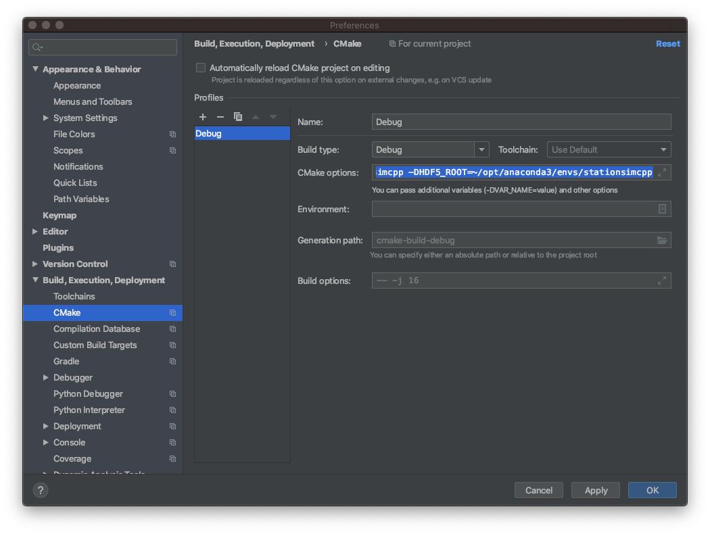

# Installing stationsimcpp

These instructions will get you a copy of stationsimcpp up and running on your machine with Ubuntu.

### Prerequisites

To get the code you will need git. To install git on Ubuntu use the following commands in a terminal

```bash
sudo apt update
sudo apt install git
```

To clone the repository from github use the following command in a terminal

```bash
git clone git@github.com:avramidis/stationsimcpp.git
```

To generate the makefiles for compiling stationsimcpp you will need cmake with release version equal of higher than 3.15.3. Go to https://cmake.org/download/
and download the latest binary distribution for Linux x86_64. For example, the latest file at the time when this quidee was written was
cmake-3.16.2-Linux-x86_64.sh. To install cmake use the following command in a terminal

```bash
sudo cmake-3.16.2-Linux-x86_64.sh
```

To build and run stationsimcpp you will need CMake, a C++ compiler, OpenMPI, HDF5, the Python3 interpreter, numpy and matplotlib.

Use the following commands in a terminal to install the CMake, GNU compiler, OpenMPI and HDF5

```bash
sudo apt update
sudo apt install cmake, build-essential g++ gcc libopenmpi-dev libhdf5-dev
```

To install the Python3 interpreter, numpy and matplotlib use the following command in a terminal

```bash
sudo apt install python3 python3-dev python3-pip python3-tk python3-numpy python3-matplotlib
```

### Build

Build with gcc navigate to the directory with 

```bash
mkdir build-gcc
cd build-gcc
cmake -DCMAKE_BUILD_TYPE=Release ..
make -j4
sudo make install
```

Note: if you have an anaconda installation of python, then you may need to tell CMake where the environment that you
want to use is actually located. Assuming your python environment is called `stationsimcpp` then you can replace the 
`cmake -DCMAKE_BUILD_TYPE=Release ..` line above with:

```
cmake -DCMAKE_BUILD_TYPE=Release -DPython3_ROOT_DIR=~/opt/anaconda3/envs/stationsimcpp/ -DHDF5_ROOT=~/opt/anaconda3/envs/stationsimcpp/ ..
```

That line not only tells CMake where the `python3` installation that you want to use can be found, but it also tells
it to use the `hdf5` library included in that environment, not the default one found somewhere else on the system. 

### Build/Run with CLion and Anacona

Here are some notes for how to build and run _stationsimcpp_ using the [CLion IDE](https://www.jetbrains.com/clion/) and [Anaconda python package manager](https://www.anaconda.com/). It assumes that you will use a command line to set up Anaconda, but you could use the GUI as well.

 1. First, install Anaconda and CLion from their respective repositories

 2. Create a python environment with the required libraries. Python is used for plotting etc.

You can create an environment called `stationsimcpp` that contains the necessary libraries and uses python 3.7 (other versions might work but we've only tested this one) using the following command:

```
conda create -n stationsimcpp python=3.7 hdf5 h5py matplotlib numpy
```

Then activate the environment:

```
conda activate stationsimcpp
```

And finally find out where the python binary is located (we will need this later):

```
which python
```

 3. Now configure the project in CLion. First, load CLion and when it asks you where to open a project choose `CMake project from sources`. When prompted, select `Open Existing Project`.

 4. Once the project has been loaded into CMake, you need to tell the complier where to find python and the HDF5 library.

Go to `Preferences` -> `Build, Execuiotion, Deployment` -> `CMake`

Then in the `CMake options` box, set two flags, `Python3_ROOT_DIR` and `HDF5_ROOT`, to point to the place where your python binaries were installed (we found this out at the end of step 2). E.g. if the python location is `~/opt/anaconda3/envs/stationsimcpp` then you would enter


```
-DPython3_ROOT_DIR=~/opt/anaconda3/envs/stationsimcpp -DHDF5_ROOT=~/opt/anaconda3/envs/stationsimcpp
```

The following figure illustrates this:


Click on `OK`.

 5. Finally, mark the following directories as `Project Sources and Headers` by right-clicking on them and choosing `Mark Directory As`
   - examples
   - include
   - source

Now you should be able to build and run the different versions of the project using CLion, and see the locations of the agents displayed as graphs by matplotlib.

## Support

If you encounter any problems, found a bug or need help, please open an [issue on github](https://github.com/avramidis/stationsimcpp/issues)  
with your system details, *exact* commands used, and logs posted as a [gist](https://gist.github.com/).